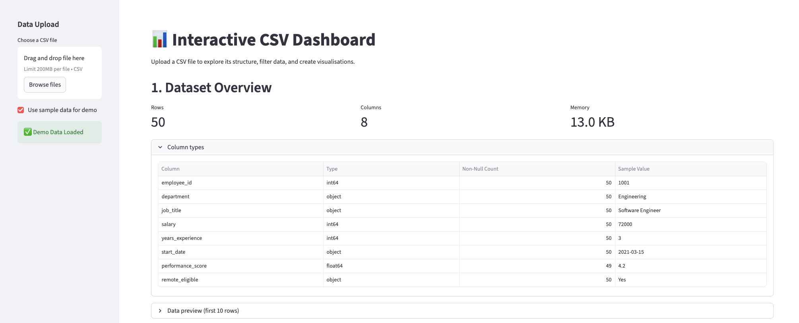
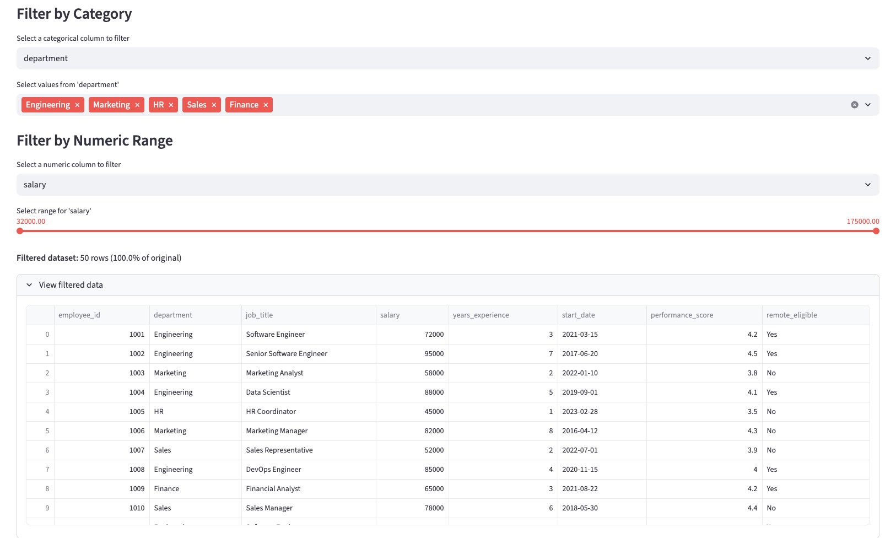
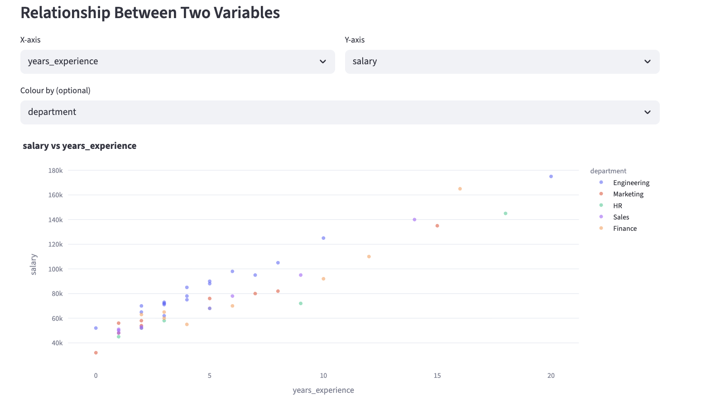
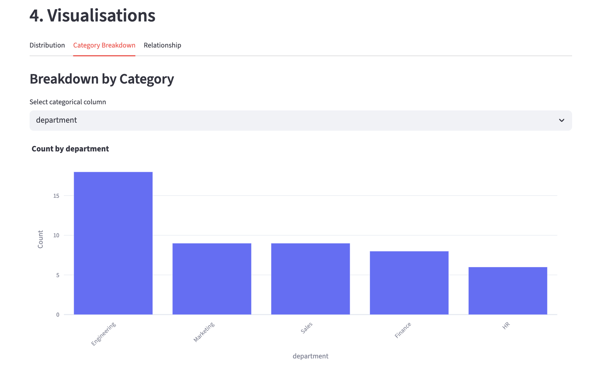

# Interactive CSV Dashboard

[](https://interactive-csv-dashboard.streamlit.app/)

**Live Demo:** [Launch Dashboard Here](https://interactive-csv-dashboard.streamlit.app/)


*Figure 1: Main interface showing automated data profiling and summary metrics.*

---

## Overview
This tool bridges the gap between raw CSV data and actionable insights. Designed for rapid Exploratory Data Analysis (EDA), it allows users to inspect data structure, identify quality issues, and visualize relationships without writing code.

**Key Capabilities:**
* **Data Integrity Checks:** Automatic detection of missing values and data type mismatches.
* **Interactive Filtering:** Slice data by categorical values or numeric ranges.
* **Multivariate Analysis:** Visualise correlations with 3-dimensional scatter plots (X, Y, Color).

## Features & Functionality

### 1. Data Quality & Filtering
The tool prioritizes data health. Upon upload, it scans for null values and provides a "Data Quality Check" report. Users can then drill down using the interactive sidebar controls.


*Figure 2: The sidebar (left) allows for granular filtering by category and numeric range, instantly updating the data table.*

### 2. Visual Analysis Gallery
The dashboard leverages Plotly for interactive plotting, supporting distribution analysis, categorical breakdowns, and correlation studies.

| Multivariate Analysis | Categorical Breakdown |
|:---------------------:|:---------------------:|
|  |  |
| *Figure 3: Scatter plot analyzing Salary vs. Experience, grouped by Department.* | *Figure 4: Distribution of employees across departments.* |

## Technical Stack
* **Framework:** Streamlit (Python)
* **Visualisation:** Plotly Express
* **Data Manipulation:** Pandas (Vectorised operations for performance)

## Installation
To run this tool locally:

```bash
# Clone the repository
git clone [https://github.com/Hexicon404/Interactive-CSV-Dashboard.git](https://github.com/Hexicon404/Interactive-CSV-Dashboard.git)

# Install dependencies
pip install -r requirements.txt

# Run the app
streamlit run app.py


- Tested with Python 3.9 and 3.11

## Licence

MIT


## Limitations

- The dashboard is designed for exploratory analysis and does not perform statistical inference or predictive modeling.
- Performance may degrade for extremely large datasets due to in-memory processing.
- The tool assumes reasonably clean tabular data and does not replace domain-specific preprocessing pipelines.

